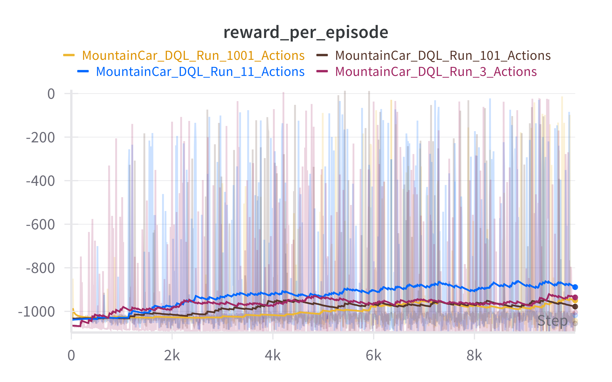

# Quantized DQL on MountainCarContinuous-v0 🏔️🚗

This project implements Deep Q-Learning (DQL) on the `MountainCarContinuous-v0` environment from [Gymnasium](https://gymnasium.farama.org/). Since DQL is inherently suited for discrete action spaces, the continuous action space of the environment is quantized to varying resolutions.

## 📌 Objective

To evaluate the performance of Deep Q-Learning under different levels of action space quantization:
- 3 discrete actions
- 11 discrete actions
- 101 discrete actions
- 1001 discrete actions

## 🧠 Method

1. **Environment**: `MountainCarContinuous-v0`
2. **Algorithm**: Deep Q-Learning
3. **Action Space Quantization**:
   - Continuous action range [-1.0, 1.0] is split into `N` evenly spaced actions.
   - Actions are discretized using `np.linspace(-1.0, 1.0, N)`.
4. **Neural Network**: Simple feedforward Q-network
5. **Exploration**: ε-greedy strategy

## 📊 Results



As expected, increasing the action space granularity improved performance **up to a certain point**.  
The graph below (to be added) shows the **average reward of the best policy** found during training, evaluated over **20 test runs** for each quantization level.


However, when the number of discrete actions becomes too high — such as **1001 actions** — training a successful agent using DQL becomes significantly harder.

Several strategies were explored to mitigate this issue:
- Different **ε-decay strategies**: linear, exponential, and hyperbolic
- **Learning rate schedules**
- Various **reward shaping techniques**

All experiment runs and configurations are available on my  
[Weights & Biases dashboard](https://wandb.ai/matteo-piras-universit-di-firenze/MountainCar%20DQL/workspace?nw=nwusermatteopiras).

The **best result** was obtained using:
- **10000 training episodes**
- **Linearly decaying ε**, which promotes more exploration

The core issue with very fine-grained (e.g., 1001) quantization appears to be **action dilution**:  
random action selection often picks values that **have little to no physical impact**, making it difficult for the agent to explore effectively and reach the reward zone.

Even when a reasonably good policy is found, the **average test reward remains low (≈ 55)**.  
This is because the policy is **unstable**: some episodes reach the goal with high reward, while others fail entirely.  
When averaged, these mixed outcomes result in a low overall reward — despite having high potential in some runs.


## 📦 Requirements

```bash
pip install -r requirements.txt
